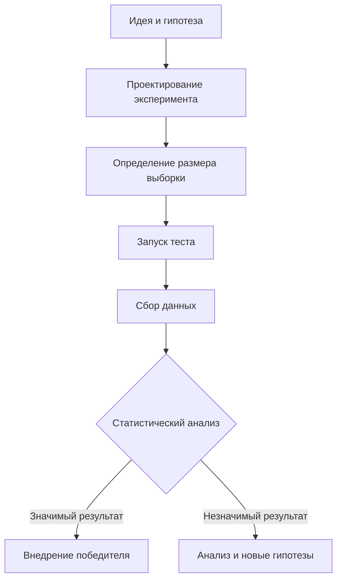

 
**A/B тестирование** — это научный метод сравнения двух версий продукта, интерфейса или контента для определения, какая из них показывает лучшие результаты по заданным метрикам.

Проще говоря: **"Мы показываем вариант A одной группе пользователей, вариант B — другой группе, и смотрим, какой вариант работает лучше"**.

---

### Основная идея

A/B тестирование позволяет принимать **обоснованные решения на основе данных**, а не на основе интуиции или мнений.

**Классический пример:**
- **Вариант A** (контрольный): Красная кнопка "Купить сейчас"
- **Вариант B** (тестовый): Зеленая кнопка "Купить сейчас"
- **Метрика:** Конверсия в покупку
- **Результат:** Вариант B дает на 15% больше покупок → принимаем решение использовать зеленую кнопку

---

### Ключевые компоненты A/B теста

#### 1. **Гипотеза**
- Четкое предположение о том, как изменение повлияет на пользователей
- **Формат:** "Если мы сделаем X, то это приведет к Y, потому что Z"
- **Пример:** "Если мы изменим цвет кнопки с красного на зеленый, то конверсия увеличится на 10%, потому что зеленый цвет ассоциируется с безопасностью и одобрением"

#### 2. **Варианты**
- **Контрольная группа (A):** Существующая версия
- **Тестовая группа (B):** Новая версия с изменениями

#### 3. **Метрики**
- **Основная метрика:** Ключевой показатель, который мы хотим улучшить
- **Второстепенные метрики:** Дополнительные показатели для мониторинга

#### 4. **Аудитория**
- Репрезентативная выборка пользователей
- Случайное разделение на группы A и B

---

### Процесс A/B тестирования



#### 1. **Формулировка гипотезы**
```python
# Пример плохой гипотезы
"Сделать кнопку зеленой"

# Пример хорошей гипотезы
"Изменение цвета кнопки CTA с красного на зеленый увеличит 
 конверсию на 10% за 30 дней, потому что зеленый цвет 
 ассоциируется с безопасностью и одобрением"
```

#### 2. **Определение метрик**
```python
# Основные метрики в зависимости от цели
METRICS = {
    'электронная коммерция': ['конверсия в покупку', 'средний чек', 'CR'],
    'мобильное приложение': ['удержание', 'LTV', 'DAU/MAU'],
    'медиа': ['время на сайте', 'глубина просмотра', 'CTR'],
    'SaaS': ['активация', 'удержание', 'доходимость до оплаты']
}
```

#### 3. **Расчет размера выборки**
```python
import numpy as np
from statsmodels.stats.power import TTestIndPower
from statsmodels.stats.proportion import proportion_effectsize

# Калькулятор размера выборки для пропорций
def calculate_sample_size(baseline_rate, mde, alpha=0.05, power=0.8):
    """
    baseline_rate: текущая конверсия (например, 0.05 для 5%)
    mde: минимальный детектируемый эффект (например, 0.1 для 10%)
    alpha: уровень значимости (вероятность ошибки I рода)
    power: мощность теста (1 - вероятность ошибки II рода)
    """
    effect_size = proportion_effectsize(baseline_rate, baseline_rate * (1 + mde))
    analysis = TTestIndPower()
    sample_size = analysis.solve_power(
        effect_size=effect_size,
        alpha=alpha,
        power=power,
        ratio=1.0  # Равные группы
    )
    return int(np.ceil(sample_size))

# Пример расчета
baseline = 0.05  # 5% конверсия
mde = 0.1        # 10% улучшение
sample_per_group = calculate_sample_size(baseline, mde)
print(f"Необходимый размер каждой группы: {sample_per_group} пользователей")
print(f"Общий размер выборки: {sample_per_group * 2} пользователей")
```

---

### Статистические основы A/B теста

#### 1. **Статистическая значимость (p-value)**
- Вероятность получить наблюдаемые результаты, если на самом деле различий нет
- **Порог значимости:** обычно p < 0.05
- **Интерпретация:** p-value = 0.03 означает 3% вероятность, что разница случайна

#### 2. **Мощность теста (Power)**
- [[Вероятность]] обнаружить эффект, если он действительно есть
- Обычно устанавливается на уровне 80-90%

#### 3. **Доверительный интервал**
- Диапазон, в котором с заданной вероятностью находится истинный эффект
- **Пример:** "Улучшение конверсии составляет 5% ± 2% с 95% доверительной вероятностью"

---

### Реализация A/B теста в Python

#### Полный пример анализа A/B теста
```python
import numpy as np
import pandas as pd
from scipy import stats
import matplotlib.pyplot as plt
import seaborn as sns

# Генерация синтетических данных A/B теста
np.random.seed(42)

# Параметры симуляции
n_control = 1000      # Размер контрольной группы
n_treatment = 1000    # Размер тестовой группы
baseline_conversion = 0.10  # Базовая конверсия 10%
lift = 0.15                 # Улучшение на 15%

# Генерация данных
control_conversions = np.random.binomial(1, baseline_conversion, n_control)
treatment_conversions = np.random.binomial(1, baseline_conversion * (1 + lift), n_treatment)

# Создание DataFrame
df_control = pd.DataFrame({
    'group': 'control',
    'converted': control_conversions
})

df_treatment = pd.DataFrame({
    'group': 'treatment', 
    'converted': treatment_conversions
})

df = pd.concat([df_control, df_treatment], ignore_index=True)

# Предварительный анализ
conversion_rates = df.groupby('group')['converted'].agg(['mean', 'count', 'sum'])
print("Статистика по группам:")
print(conversion_rates)
print(f"\nРазница в конверсии: {conversion_rates.loc['treatment', 'mean'] - conversion_rates.loc['control', 'mean']:.4f}")

# Визуализация
plt.figure(figsize=(10, 6))

plt.subplot(1, 2, 1)
sns.barplot(x='group', y='converted', data=df, ci=None)
plt.title('Конверсия по группам')
plt.ylabel('Конверсия')

plt.subplot(1, 2, 2)
daily_data = pd.DataFrame({
    'day': np.tile(range(14), 2),
    'group': np.repeat(['control', 'treatment'], 14),
    'conversions': np.concatenate([
        np.random.binomial(n_control//14, baseline_conversion, 14),
        np.random.binomial(n_treatment//14, baseline_conversion * (1 + lift), 14)
    ]),
    'visitors': np.concatenate([
        np.full(14, n_control//14),
        np.full(14, n_treatment//14)
    ])
})
daily_data['conversion_rate'] = daily_data['conversions'] / daily_data['visitors']

sns.lineplot(x='day', y='conversion_rate', hue='group', data=daily_data)
plt.title('Динамика конверсии по дням')
plt.tight_layout()
plt.show()
```

#### Статистический тест
```python
from statsmodels.stats.proportion import proportions_ztest

# Z-тест для пропорций
def ab_test_analysis(control_conversions, control_total, treatment_conversions, treatment_total, alpha=0.05):
    """
    Проводит статистический анализ A/B теста
    """
    # Считаем конверсии
    conv_control = control_conversions / control_total
    conv_treatment = treatment_conversions / treatment_total
    lift = (conv_treatment - conv_control) / conv_control
    
    # Z-тест
    successes = [treatment_conversions, control_conversions]
    nobs = [treatment_total, control_total]
    
    z_stat, p_value = proportions_ztest(successes, nobs, alternative='larger')
    
    # Доверительный интервал
    se = np.sqrt(conv_treatment*(1-conv_treatment)/treatment_total + conv_control*(1-conv_control)/control_total)
    margin = stats.norm.ppf(1 - alpha/2) * se
    ci_lower = (conv_treatment - conv_control) - margin
    ci_upper = (conv_treatment - conv_control) + margin
    
    # Интерпретация
    significant = p_value < alpha
    
    return {
        'control_conversion': conv_control,
        'treatment_conversion': conv_treatment,
        'lift': lift,
        'lift_absolute': conv_treatment - conv_control,
        'p_value': p_value,
        'significant': significant,
        'confidence_interval': (ci_lower, ci_upper),
        'z_statistic': z_stat
    }

# Применяем тест к нашим данным
control_conv = conversion_rates.loc['control', 'sum']
control_total = conversion_rates.loc['control', 'count']
treatment_conv = conversion_rates.loc['treatment', 'sum'] 
treatment_total = conversion_rates.loc['treatment', 'count']

results = ab_test_analysis(control_conv, control_total, treatment_conv, treatment_total)

print("\n=== РЕЗУЛЬТАТЫ A/B ТЕСТА ===")
print(f"Конверсия контрольной группы: {results['control_conversion']:.3f}")
print(f"Конверсия тестовой группы: {results['treatment_conversion']:.3f}")
print(f"Абсолютный лифт: {results['lift_absolute']:.4f}")
print(f"Относительный лифт: {results['lift']:.2%}")
print(f"p-value: {results['p_value']:.4f}")
print(f"Статистически значимо: {results['significant']}")
print(f"95% доверительный интервал: [{results['confidence_interval'][0]:.4f}, {results['confidence_interval'][1]:.4f}]")

# Интерпретация результатов
if results['significant']:
    if results['lift_absolute'] > 0:
        print("\n🎉 ТЕСТОВАЯ ГРУППА ПОБЕДИЛА! Различие статистически значимое.")
    else:
        print("\n📉 КОНТРОЛЬНАЯ ГРУППА ЛУЧШЕ! Различие статистически значимое.")
else:
    print("\n🤷 НЕТ СТАТИСТИЧЕСКИ ЗНАЧИМОЙ РАЗНИЦЫ между группами.")
```

---

### Распространенные ошибки в A/B тестировании

#### 1. **Слишком ранняя остановка теста**
```python
# НЕПРАВИЛЬНО: Останавливать тест при первом "значимом" результате
# ПРАВИЛЬНО: Дождаться запланированного размера выборки

def check_peeking_problem():
    """Демонстрация проблемы преждевременной остановки"""
    np.random.seed(42)
    
    # Симуляция: на самом деле разницы нет
    baseline = 0.10
    daily_visitors = 1000
    
    false_positives = 0
    for experiment in range(100):
        # Собираем данные день за днем
        for day in range(14):
            control = np.random.binomial(daily_visitors, baseline)
            treatment = np.random.binomial(daily_visitors, baseline)
            
            # Проверяем значимость каждый день (НЕПРАВИЛЬНО!)
            if day >= 2:  # Начинаем проверять после 3 дней
                p_val = proportions_ztest([treatment, control], [daily_visitors, daily_visitors])[1]
                if p_val < 0.05:
                    false_positives += 1
                    break  # Преждевременно останавливаем тест
    
    print(f"Ложноположительных срабатываний при ежедневной проверке: {false_positives}%")
```

#### 2. **Недостаточная мощность теста**
```python
def calculate_required_duration(baseline_rate, mde, daily_traffic, alpha=0.05, power=0.8):
    """Расчет необходимой длительности теста"""
    sample_per_group = calculate_sample_size(baseline_rate, mde, alpha, power)
    days_needed = np.ceil((sample_per_group * 2) / daily_traffic)
    return int(days_needed)

# Пример
baseline = 0.05
mde = 0.1  # 10% улучшение
daily_traffic = 1000

days = calculate_required_duration(baseline, mde, daily_traffic)
print(f"Необходимая длительность теста: {days} дней")
```

---

### Продвинутые варианты тестирования

#### 1. **Многовариантное тестирование (MVT)**
- Тестирование нескольких изменений одновременно
- **Пример:** Тестирование комбинации заголовка, изображения и CTA

#### 2. **Сплит-тестирование по сегментам**
```python
# Анализ результатов по сегментам
def analyze_by_segment(df, segment_column):
    """Анализ A/B теста по сегментам"""
    segments = df[segment_column].unique()
    results = {}
    
    for segment in segments:
        segment_data = df[df[segment_column] == segment]
        control = segment_data[segment_data['group'] == 'control']['converted']
        treatment = segment_data[segment_data['group'] == 'treatment']['converted']
        
        # Проводим тест для сегмента
        p_val = stats.ttest_ind(control, treatment, equal_var=False).pvalue
        lift = treatment.mean() - control.mean()
        
        results[segment] = {
            'sample_size': len(segment_data),
            'lift': lift,
            'p_value': p_val,
            'significant': p_val < 0.05
        }
    
    return results
```

---

### Best Practices A/B тестирования

#### 1. **Планирование**
- Четко формулируйте гипотезу
- Определите основные и второстепенные метрики
- Рассчитайте достаточный размер выборки

#### 2. **Запуск**
- Убедитесь в случайности распределения
- Исключите сезонные эффекты
- Мониторьте качество данных

#### 3. **Анализ**
- Проверяйте статистическую значимость
- Анализируйте по сегментам
- Смотрите на доверительные интервалы

#### 4. **Принятие решений**
- Основано на данных, а не на интуиции
- Учитывайте бизнес-контекст
- Документируйте результаты

---

### Инструменты для A/B тестирования

- **Google Optimize** — бесплатный инструмент для веб-тестирования
- **Optimizely** — профессиональная платформа
- **VWO** — визуальный редактор для A/B тестов
- **Python библиотеки:** scipy, statsmodels, bayesian_testing

---

### Когда НЕ использовать A/B тестирование?

#### ❌ **Плохие сценарии:**
- Очень маленькая аудитория
- Критически важные изменения (безопасность, юридические вопросы)
- Изменения, которые нельзя откатить
- Когда нет четкой метрики успеха

#### ✅ **Идеальные сценарии:**
- Оптимизация конверсии сайта
- Улучшение пользовательского опыта
- Тестирование ценовых стратегий
- Оптимизация email-рассылок

---

### Пример из практики: Оптимизация регистрации

```python
# Гипотеза: "Упрощение формы регистрации с 10 до 5 полей увеличит конверсию на 20%"

# Результаты теста
results = {
    'control': {'conversions': 450, 'visitors': 10000},  # 4.5% конверсия
    'treatment': {'conversions': 540, 'visitors': 10000} # 5.4% конверсия
}

analysis = ab_test_analysis(
    results['control']['conversions'], results['control']['visitors'],
    results['treatment']['conversions'], results['treatment']['visitors']
)

print(f"Упрощение формы дало улучшение конверсии на {analysis['lift']:.1%}")
print(f"Статистическая значимость: {analysis['p_value']:.4f}")

if analysis['significant']:
    # Бизнес-инсайт
    monthly_visitors = 50000
    additional_conversions = monthly_visitors * analysis['lift_absolute']
    print(f"При месячной аудитории 50K: {additional_conversions:.0f} дополнительных регистраций в месяц")
```

---

### Краткий итог

- **A/B тестирование** — научный метод сравнения двух вариантов
- **Основано на статистике** — p-value, доверительные интервалы, мощность теста
- **Процесс:** Гипотеза → Дизайн эксперимента → Запуск → Анализ → Решение
- **Ключевые метрики:** Конверсия, доход, вовлеченность
- **Избегайте ошибок:** Преждевременная остановка, недостаточная мощность, сегментационная bias
- **Используйте** для data-driven принятия решений в продукте, маркетинге и UX

A/B тестирование — это мощный инструмент, который позволяет заменить мнения и догадки надежными данными, что приводит к лучшим бизнес-результатам и более эффективному развитию продукта.