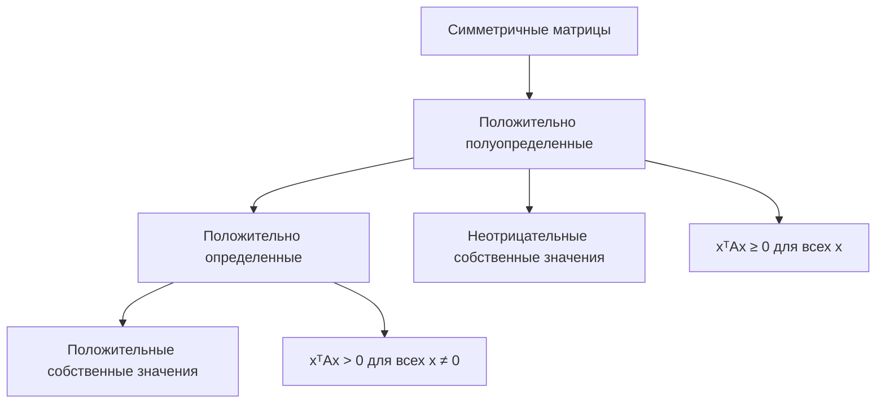

 
Отличный вопрос! **Положительно полуопределенная матрица** — это ключевое понятие в линейной алгебре и математической статистике с важными практическими приложениями.

## **Формальное определение**

Квадратная матрица $A \in \mathbb{R}^{n \times n}$ называется **положительно полуопределенной**, если для **любого** вектора $x \in \mathbb{R}^n$ выполняется:

$$x^T A x \geq 0$$

где $x^T$ — транспонированный вектор (вектор-строка).

---

## **Эквивалентные характеристики**

Матрица является положительно полуопределенной, если выполняется **любое** из следующих условий:

### 1. **Через квадратичную форму**

$$x^T A x \geq 0 \quad \text{для всех } x \in \mathbb{R}^n$$


### 2. **Через [[Собственные значения матрицы|собственные значения]]**
- Все собственные значения матрицы$A$ **неотрицательны**
-$\lambda_i \geq 0$ для всех $i = 1, \dots, n$

### 3. **Через главные миноры**
- Все **главные миноры** матрицы неотрицательны
- Главный минор — определитель подматрицы, образованной первыми $k$ строками и столбцами

### 4. **Для симметричных матриц** (частый случай)
Если $A$ симметрична ($A = A^T$), то существует разложение:

$$A = Q \Lambda Q^T$$
где $Q$ — ортогональная матрица, $\Lambda$ — диагональная матрица с неотрицательными элементами (собственными значениями).

---

## **Примеры**

### Пример 1: Положительно полуопределенная матрица
$$A = \begin{pmatrix} 2 & 1 \\ 1 & 2 \end{pmatrix}$$

Проверим для произвольного вектора$x = (x_1, x_2)^T$:
$$x^T A x = \begin{pmatrix} x_1 & x_2 \end{pmatrix} \begin{pmatrix} 2 & 1 \\ 1 & 2 \end{pmatrix} \begin{pmatrix} x_1 \\ x_2 \end{pmatrix} = 2x_1^2 + 2x_1x_2 + 2x_2^2$$
$$= 2(x_1^2 + x_1x_2 + x_2^2) \geq 0 \quad \text{для всех } x_1, x_2$$

Собственные значения: $\lambda_1 = 3, \lambda_2 = 1$ (оба положительны)

### Пример 2: НЕ положительно полуопределенная матрица

$$B = \begin{pmatrix} 1 & 2 \\ 2 & 1 \end{pmatrix}$$

Для $x = (1, -1)^T$:
$$x^T B x = \begin{pmatrix} 1 & -1 \end{pmatrix} \begin{pmatrix} 1 & 2 \\ 2 & 1 \end{pmatrix} \begin{pmatrix} 1 \\ -1 \end{pmatrix} = -2 < 0
$$

Собственные значения: $\lambda_1 = 3, \lambda_2 = -1$ (одно отрицательное)

---

## **Геометрическая интерпретация**

Для квадратичной формы$f(x) = x^T A x$:

- **Положительно полуопределенная**: Квадратичная форма представляет собой **"чашу"**, которая всюду неотрицательна, но может иметь "плоские" участки (где равна 0)
- **Положительно определенная**: Строго положительная "чаша" без плоских участков
- **Отрицательно полуопределенная**: "Перевернутая чаша", всюду неположительная

---

## **Связь с другими типами матриц**



---

## **Приложения в статистике**

### 1. **Ковариационные матрицы**
Любая ковариационная матрица $\Sigma$ является положительно полуопределенной. Для любого вектора $x$:
$$x^T \Sigma x = \text{Var}(x^T X) \geq 0$$
Так как дисперсия всегда неотрицательна.

### 2. **Неравенство Крамера-Рао**
Запись $\text{Cov}(\hat{\theta}) \geq I(\theta)^{-1}$ означает, что матрица:
$$\text{Cov}(\hat{\theta}) - I(\theta)^{-1}$$
является положительно полуопределенной.

**Интерпретация**: Для любой линейной комбинации параметров оценка имеет дисперсию не меньше, чем предсказывает граница Крамера-Рао.

### 3. **Многомерное нормальное распределение**
Плотность многомерного нормального распределения:
$$f(x) = \frac{1}{\sqrt{(2\pi)^n |\Sigma|}} \exp\left(-\frac{1}{2}(x-\mu)^T \Sigma^{-1}(x-\mu)\right)$$
требует, чтобы$\Sigma$ была положительно определенной.

---

## **Проверка на положительную полуопределенность**

### Практические способы:

1. **Вычисление собственных значений**
   ```python
   import numpy as np
   
   A = np.array([[2, 1], [1, 2]])
   eigenvalues = np.linalg.eigvals(A)
   # Если все eigenvalues >= 0, то матрица PSD
   ```

2. **Критерий Сильвестра**
   - Все главные миноры неотрицательны.
   - Для матрицы$\begin{pmatrix} a & b \\ b & c \end{pmatrix}$:$a \geq 0, c \geq 0, ac - b^2 \geq 0$.

3. **Разложение Холецкого**
   - Если можно выполнить разложение Холецкого $A = LL^T$, то матрица положительно полуопределенная.

---

## **Важные свойства**

- Сумма положительно полуопределенных матриц — положительно полуопределенная
- Если $A$ — положительно полуопределенная, то $BAB^T$ — тоже для любой матрицы $B$
- Все диагональные элементы неотрицательны
- След матрицы равен сумме собственных значений и поэтому неотрицателен

**Положительно полуопределенная матрица** — это математическая формализация понятия "неотрицательности" для матриц, играющая важную роль в оптимизации, статистике и машинном обучении.